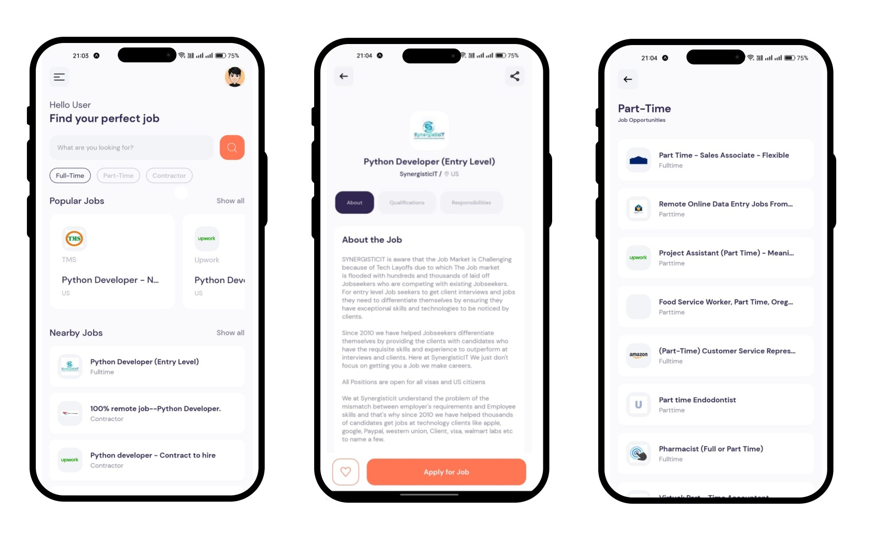

# Job Search React-native App ([Visit](https://expo.dev/@mas_99/React_Native_Jobs?serviceType=classic&distribution=expo-go)) 
### [Note: Please install Expo App first from playstore for android user] 

An app with modern and user-friendly UI/UX for finding suitable job offers.Build with React-Native and expo tools. This app uses JSearch API to fetch data from source. This app comes with search functionality, pagination, job-details page etc. In future I will other features such as login/signup (user accounts), proper sliding menu bar and other minor enhancements.

## Active Pages
- Welcome page
- Full-Time Job page
- Part-Time Job page
- Contarctor job page
- Job Details page
- Search Result page
  

## Key Features
- Search functionality
- Proper pagination
- Job Details page
- Dynamic data rendering from relatime API call
- Modern and user friendly UI/UX

### Screenshot

  

